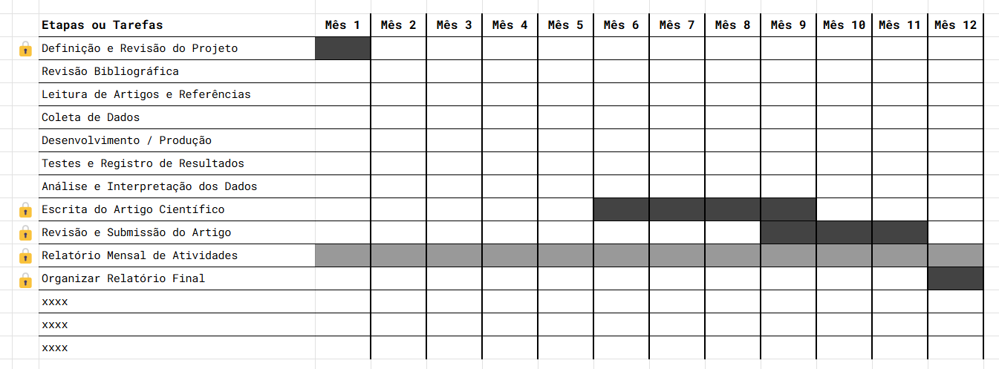

# 📄 Template de Projeto de Iniciação Científica  

## 🧪 TÍTULO DO PROJETO

> Escreva um título claro, objetivo e representativo do tema da pesquisa.

 

## 🔍 RESUMO

> Em até 20 linhas, apresente o objetivo central do projeto, a metodologia proposta e os resultados esperados. Esta parte deve ser escrita ao final, após a elaboração completa do projeto.

 

## 🧭 INTRODUÇÃO E JUSTIFICATIVA

> Explique o tema escolhido e o contexto em que está inserido. Destaque a relevância social, acadêmica ou científica do projeto.  
>  
> Apresente brevemente o que já se sabe sobre o assunto (com base na bibliografia existente) e justifique por que vale a pena estudá-lo.

 

## 🎯 OBJETIVOS

### Objetivo Geral  
> Declare o objetivo principal da pesquisa — o que se pretende descobrir, analisar ou desenvolver?  

### Objetivos Específicos  
> Liste metas mais específicas que organizam o caminho até o objetivo geral.  
>  
> **Exemplo:**  
> Realizar revisão bibliográfica sobre o tema;  
> Aplicar a metodologia X para análise dos dados;  
> Comparar os resultados obtidos com estudos anteriores;  

 

## 🛠️ METODOLOGIA

> Descreva como a pesquisa será realizada:  
> - Abordagem adotada (qualitativa, quantitativa ou mista)  
> - Uso de dados: serão coletados? Quais fontes?  
> - Técnicas de coleta (entrevistas, experimentos, observação etc.)  
> - Ferramentas e instrumentos utilizados  
> - Critérios de análise e estratégias para interpretação dos resultados  
> - Etapas previstas da pesquisa (planejamento, execução, análise, etc.)

## 📅 CRONOGRAMA

> Organize as atividades por mês (ou trimestre), indicando o que será feito em cada etapa.  
>  
> Em projetos em grupo, inclua um **Cronograma Geral** e **Cronogramas Específicos** (por pessoa ou subgrupo).  
>  

Utilize esse [**template**](https://docs.google.com/spreadsheets/d/1sBZJ6VwQgBCnR_fh5zgpyhxsVSxikD7C/edit?usp=sharing&ouid=103942279604515028708&rtpof=true&sd=true) para construir seu cronograma.

## 🧮 ANÁLISE DOS RESULTADOS

> Explique como os dados obtidos serão analisados. Quais indicadores ou critérios serão usados? Como os resultados serão validados ou discutidos? Relacione a análise com os objetivos da pesquisa.

## 🧪 RESULTADOS ESPERADOS

> O que se pretende alcançar com a pesquisa?  
> Considere incluir: geração de novos dados, propostas de solução para um problema, produção de publicações (artigo, resumo expandido, pôster), aplicações práticas ou teóricas

## 📎 REFERÊNCIAS BIBLIOGRÁFICAS

> Apresente os principais autores, teorias e trabalhos acadêmicos que fundamentam sua proposta.  Liste todas as obras citadas no projeto, no padrão ABNT.  
>
> **Exemplo:**  
> SANTOS, Boaventura de Sousa. *Um discurso sobre as ciências*. 23ª ed. São Paulo: Cortez, 2019.

**Explorar:**  
[Connected Papers](https://www.connectedpapers.com/)  
Bases de dados acadêmicas (Google Scholar, Scielo, Scopus, etc.)  
Seleção e pesquisa por palavras-chave    
